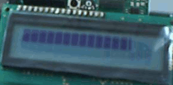

# LCDBar

**A simple LCD bargraph library for Arduino**


## Purpose

LCDBar is a versatile bar graph/progress bar library designed for use with the Waveshare_LCD1602_RGB display. It leverages custom LCD characters to achieve increased resolution, leading to a super high-res look, providing detailed visual representations of data. 


## Simple Example

```c++
#include "Waveshare_LCD1602_RGB.h"
#include "LCDBar.h"

Waveshare_LCD1602_RGB lcd(16,2);

// display,width
LCDBar bar(&lcd, 16);

void setup() {
  lcd.init();
  lcd.clear();  
  delay(100);
}

void loop() {
  bar.drawValue(analogRead(A0));
}
```

## Videos

**High resolution bar**

[]


## Dependencies

This library depends on the following libraries:

- Waveshare_LCD1602_RGB https://files.waveshare.com/upload/5/5b/LCD1602-RGB-Module-demo.zip
